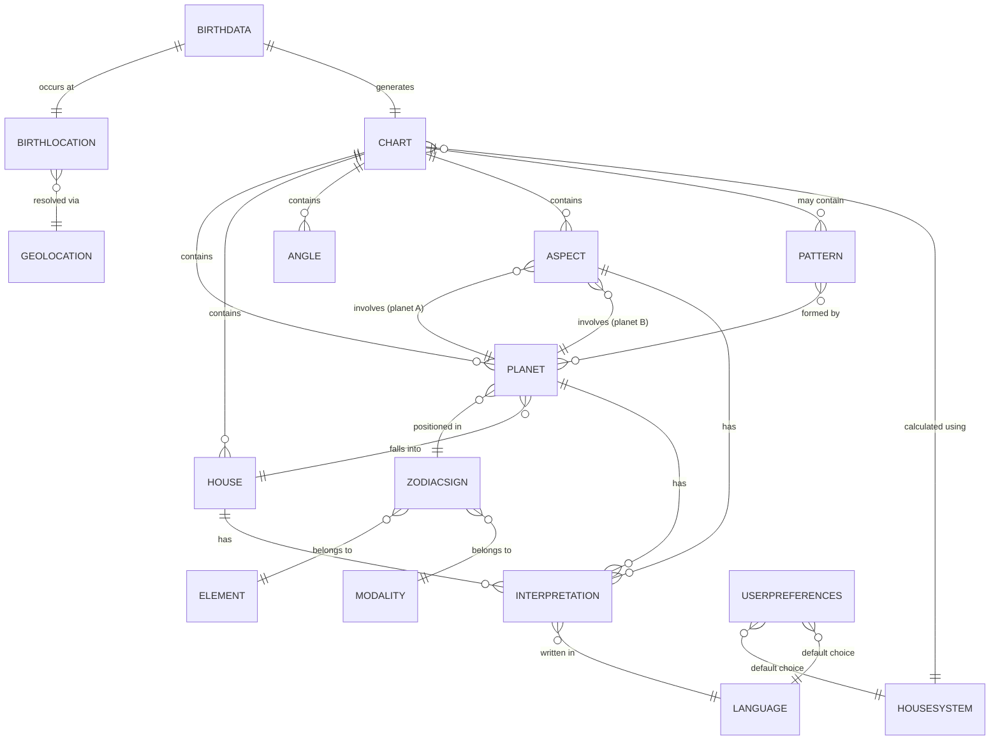
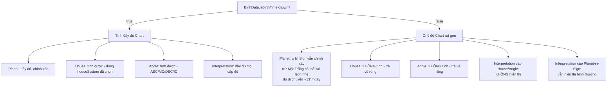

# Astrology Domain Specification
## AstroViet Platform — Domain Model & Business Rules

| | |
|---|---|
| **Loại tài liệu** | Domain Specification (Software Design Document) |
| **Phiên bản** | 1.0 |
| **Ngày soạn** | 09/07/2026 |
| **Tác giả** | Professional Western Astrologer & Domain Expert |
| **Phạm vi** | Natal Chart (core) — nền tảng cho Database / Backend / API / Frontend / AI Interpretation |
| **Nguyên tắc thiết kế** | Implementation-independent, database-independent, framework-independent |

---

## Mục lục (Table of Contents)

1. [Giới thiệu & Phạm vi](#1-giới-thiệu--phạm-vi)
2. [Nguyên tắc thiết kế (Design Principles)](#2-nguyên-tắc-thiết-kế-design-principles)
3. [Sơ đồ tổng quan Domain Model](#3-sơ-đồ-tổng-quan-domain-model)
4. [Phân loại Business Rules](#4-phân-loại-business-rules-astrological-vs-website)
5. [Domain Entities](#5-domain-entities)
   - 5.1 [BirthData](#51-birthdata)
   - 5.2 [BirthLocation / Geolocation](#52-birthlocation--geolocation)
   - 5.3 [Chart](#53-chart)
   - 5.4 [Planet](#54-planet)
   - 5.5 [ZodiacSign](#55-zodiacsign)
   - 5.6 [Element](#56-element)
   - 5.7 [Modality](#57-modality)
   - 5.8 [House](#58-house)
   - 5.9 [HouseSystem](#59-housesystem)
   - 5.10 [Angle](#510-angle)
   - 5.11 [Aspect](#511-aspect)
   - 5.12 [Pattern](#512-pattern)
   - 5.13 [Interpretation](#513-interpretation)
   - 5.14 [UserPreferences](#514-userpreferences)
   - 5.15 [Language](#515-language)
6. [Cross-cutting Rule: Unknown Birth Time](#6-cross-cutting-rule-unknown-birth-time)
7. [Validation Rules — Tổng hợp](#7-validation-rules--tổng-hợp)
8. [Glossary](#8-glossary)
9. [Appendix](#9-appendix)

---

## 1. Giới thiệu & Phạm vi

Tài liệu này định nghĩa **domain model** (mô hình nghiệp vụ) cho phần lõi Chiêm tinh học phương Tây (Western Astrology) của nền tảng AstroViet. Đây **không phải** tài liệu thiết kế database hay API cụ thể — mà là lớp trừu tượng nghiệp vụ mà mọi lớp kỹ thuật phía sau (schema, endpoint, UI component, prompt cho AI) đều phải tuân theo và tham chiếu.

**Phạm vi hiện tại (Scope):**
- Natal Chart (lá số cá nhân) — entity trung tâm
- Hệ thống nhà: Placidus, Whole Sign
- 10 hành tinh chuẩn (Sun → Pluto) + các điểm nhạy cảm tùy chọn: Chiron, Lilith, North Node, South Node
- 12 Cung hoàng đạo, phân loại theo Element & Modality
- 12 Nhà chiêm tinh
- 5 loại góc hợp chính: Conjunction, Sextile, Square, Trine, Opposition

**Ngoài phạm vi (Out-of-scope) ở phiên bản này:** Synastry, Composite Chart, Transit, Progressions, Solar Return — các entity này sẽ *mở rộng* từ domain model dưới đây, không thay thế nó (xem mục 2 về nguyên tắc mở rộng).

---

## 2. Nguyên tắc thiết kế (Design Principles)

| Nguyên tắc | Ý nghĩa thực tiễn |
|---|---|
| **Implementation-independent** | Domain model mô tả *khái niệm và quan hệ*, không mô tả class, ORM, hay ngôn ngữ lập trình cụ thể |
| **Database-independent** | Attributes được mô tả bằng kiểu dữ liệu logic (số thực, chuỗi, boolean, enum...), không gắn với kiểu cột SQL/NoSQL cụ thể |
| **Framework-independent** | Không giả định React, Flutter, hay bất kỳ framework nào — chỉ mô tả dữ liệu và hành vi nghiệp vụ |
| **Separation of concerns** | Tách biệt rõ **dữ liệu tính toán được** (vị trí hành tinh — deterministic, tính bằng thuật toán thiên văn) khỏi **dữ liệu diễn giải** (interpretation — nội dung biên soạn, có thể thay đổi theo ngôn ngữ/phong cách) |
| **Astrological Rule ≠ Business Rule** | Quy luật thiên văn/chiêm tinh (immutable, đúng với mọi phần mềm chiêm tinh) phải tách bạch hoàn toàn khỏi quy luật vận hành sản phẩm (thay đổi theo quyết định kinh doanh) — xem Mục 4 |
| **Extensibility** | Mọi entity được thiết kế sao cho Synastry, Transit, Composite... trong tương lai có thể **tái sử dụng** (Planet, Sign, House, Aspect) mà không cần định nghĩa lại từ đầu — ví dụ Synastry Chart về bản chất là phép so sánh giữa 2 instance của `Chart` |

---

## 3. Sơ đồ tổng quan Domain Model



**Cách đọc sơ đồ:** `Chart` là entity trung tâm, được sinh ra từ `BirthData`. Chart *chứa* các Planet, House, Angle, Aspect, Pattern — đây là **dữ liệu tính toán được (computed data)**. Mỗi thành phần đó có thể *có* một hoặc nhiều `Interpretation` — đây là **dữ liệu nội dung (content data)**, tách biệt hoàn toàn khỏi lớp tính toán.

---

## 4. Phân loại Business Rules (Astrological vs. Website)

Đây là nguyên tắc quan trọng nhất của tài liệu này. **Hai loại quy tắc không bao giờ được viết lẫn vào nhau**, kể cả trong code lẫn trong tài liệu:

| | **Astrological Rule** | **Website Business Rule** |
|---|---|---|
| **Định nghĩa** | Quy luật bắt nguồn từ thiên văn học / truyền thống chiêm tinh học phương Tây, đúng một cách khách quan, không phụ thuộc vào sản phẩm | Quy tắc vận hành do đội ngũ sản phẩm quyết định, có thể thay đổi theo chiến lược kinh doanh |
| **Ví dụ 1** | Sao Hỏa nghịch hành (retrograde) được xác định bởi tốc độ góc (speed) của hành tinh mang giá trị âm | Guest user không được xem AI Interpretation, chỉ member mới được xem |
| **Ví dụ 2** | Nếu không có giờ sinh, không thể tính chính xác Ascendant (Cung Mọc) và hệ thống Nhà | Nếu không có giờ sinh, hệ thống **chỉ hiển thị** lá số dạng Whole Sign rút gọn thay vì báo lỗi (đây là quyết định UX/business) |
| **Ví dụ 3** | Trine (120°) giữa hai hành tinh được xem là góc hợp hài hòa (harmonious) | Bản báo cáo miễn phí chỉ hiển thị 3 góc hợp quan trọng nhất, ẩn phần còn lại sau paywall |
| **Nơi lưu trữ trong hệ thống** | Domain logic layer / Calculation Engine — **immutable theo mọi sản phẩm chiêm tinh** | Application/Business logic layer — **riêng của AstroViet**, có thể thay đổi mà không ảnh hưởng đến độ chính xác chiêm tinh |
| **Ai có quyền thay đổi** | Chỉ thay đổi nếu sai về mặt thiên văn học (gần như không bao giờ) | Product Manager / Stakeholder có thể thay đổi theo từng giai đoạn kinh doanh |

> ⚠️ **Nguyên tắc bắt buộc khi triển khai:** Astrological Rules nên nằm trong một module/service riêng (ví dụ `AstrologyCalculationEngine`), hoàn toàn không biết gì về khái niệm "guest user", "premium", "paywall". Các khái niệm đó chỉ được xử lý ở tầng ứng dụng phía trên, *sau khi* đã nhận kết quả tính toán thuần túy từ engine.

---

## 5. Domain Entities

### 5.1 BirthData

**Định nghĩa:** Tập hợp thông tin thời điểm sinh của một cá nhân — nền tảng đầu vào để tính toán mọi thứ trong Chart. Trong chiêm tinh học, đây được gọi là "the moment" — thời khắc bầu trời được "chụp lại" tại một địa điểm cụ thể.

**Mục đích:** Là input entity duy nhất cần thiết để engine tính toán sinh ra toàn bộ Chart. Tách biệt khỏi Chart để có thể tái sử dụng cho nhiều loại chart (Natal, Transit gốc, Composite...) trong tương lai.

**Thuộc tính (Attributes):**

| Attribute | Kiểu dữ liệu | Bắt buộc | Mô tả |
|---|---|---|---|
| id | UUID | ✔ | Định danh duy nhất |
| fullName | string | ✘ | Tên chủ thể (dùng để cá nhân hóa hiển thị, không ảnh hưởng tính toán) |
| birthDate | date (ISO 8601) | ✔ | Ngày/tháng/năm sinh |
| birthTime | time (ISO 8601) | ✘ | Giờ/phút sinh — có thể null (xem Mục 6) |
| isBirthTimeKnown | boolean | ✔ | Cờ đánh dấu rõ ràng việc giờ sinh có được biết chính xác hay không (không suy luận ngầm từ birthTime = null) |
| birthLocation | BirthLocation (reference) | ✔ | Xem 5.2 |
| timezoneAtBirth | IANA timezone string | ✔ | Múi giờ tại thời điểm và địa điểm sinh (không phải múi giờ hiện tại của địa điểm đó) |

**Quan hệ (Relationships):**
```
BirthData
  1-1 → BirthLocation
  1-1 → Chart (sinh ra đúng 1 Chart chính, nhưng có thể được dùng lại để tính nhiều loại chart phái sinh trong tương lai)
```

**Business Rules:**

| Loại | Quy tắc |
|---|---|
| Astrological | Thời điểm sinh phải được quy đổi về **Universal Time (UT)** trước khi tính toán vị trí hành tinh — mọi ephemeris đều tính theo UT |
| Astrological | Nếu `isBirthTimeKnown = false`, hệ thống **không được** tự ý gán giờ mặc định (ví dụ 12:00) *rồi tính như thể đó là giờ thật* — giá trị mặc định (nếu có) chỉ dùng cho mục đích hiển thị Sun/Moon sign gần đúng, phải luôn đi kèm cảnh báo |
| Business | Sản phẩm quyết định có cho phép nhập "khoảng thời gian ước lượng" (ví dụ "buổi sáng") thay vì giờ chính xác hay không — đây là quyết định UX, không phải quy luật chiêm tinh |

**Validation Rules:**
- `birthDate` phải là ngày hợp lệ theo lịch Gregorian, không ở tương lai so với thời điểm hiện tại.
- `birthTime`, nếu có, phải trong khoảng `00:00:00` – `23:59:59`.
- `timezoneAtBirth` phải là một giá trị hợp lệ trong **IANA Time Zone Database** (không dùng offset cố định như "+07:00" vì không phản ánh đúng lịch sử thay đổi múi giờ).
- Nếu `isBirthTimeKnown = false` thì `birthTime` phải là `null` (không được vừa false vừa có giá trị giờ — tránh mâu thuẫn dữ liệu).

---

### 5.2 BirthLocation / Geolocation

**Định nghĩa:** Địa điểm địa lý nơi sự kiện sinh diễn ra, biểu diễn dưới dạng tọa độ thiên văn (kinh độ, vĩ độ) — yếu tố bắt buộc để tính Ascendant, hệ thống Nhà, và hiệu chỉnh thời gian địa phương.

**Mục đích:** Trong chiêm tinh học, *cùng một thời điểm* nhưng *khác địa điểm* sẽ cho ra Chart khác nhau (đặc biệt là Houses và Angles). Đây là lý do BirthLocation phải là entity độc lập, chính xác, không phải chuỗi text tự do.

**Thuộc tính:**

| Attribute | Kiểu dữ liệu | Bắt buộc | Mô tả |
|---|---|---|---|
| id | UUID | ✔ | Định danh |
| placeName | string | ✔ | Tên hiển thị (ví dụ: "Đà Lạt, Lâm Đồng, Việt Nam") |
| latitude | decimal (-90 → 90) | ✔ | Vĩ độ |
| longitude | decimal (-180 → 180) | ✔ | Kinh độ |
| geolocationSource | Geolocation (reference) | ✔ | Nguồn tra cứu địa danh (xem bên dưới) |
| historicalTimezoneId | IANA timezone string | ✔ | Múi giờ áp dụng **tại thời điểm sinh** (có thể khác múi giờ hiện tại của địa danh đó do lịch sử thay đổi múi giờ) |

**Geolocation (sub-concept):** đại diện cho nguồn/dịch vụ tra cứu tọa độ từ tên địa danh (geocoding). Về mặt domain, đây là một *capability* (khả năng phân giải placeName → lat/long) chứ không phải dữ liệu nghiệp vụ chiêm tinh — cần được mô hình hóa như một service ranh giới ngoài (external boundary), domain chỉ quan tâm đến **kết quả** (lat/long/timezone) chứ không quan tâm *cách* nó được tra ra.

**Quan hệ:**
```
BirthLocation
  N-1 → Geolocation (được phân giải bởi một provider geocoding)
  1-1 ← BirthData
```

**Business Rules:**

| Loại | Quy tắc |
|---|---|
| Astrological | Vĩ độ ảnh hưởng trực tiếp đến khả năng tính hệ thống Nhà Placidus — tại các vĩ độ cực (gần 66.5°+), thuật toán Placidus có thể **không hội tụ** (không tính được) cho một số cung; hệ thống phải xử lý trường hợp này (ví dụ tự động fallback sang Whole Sign kèm thông báo) |
| Business | Sản phẩm quyết định dùng nhà cung cấp geocoding nào (Google Places, OpenStreetMap...) — không ảnh hưởng đến kết quả chiêm tinh miễn là tọa độ trả về chính xác |

**Validation Rules:**
- `latitude` ∈ [-90, 90]; `longitude` ∈ [-180, 180] (Longitude must be within valid Earth coordinates).
- `historicalTimezoneId` phải là giá trị hợp lệ trong IANA Time Zone Database.
- `placeName` không được rỗng.

---

### 5.3 Chart

**Định nghĩa:** Bản đồ sao — biểu diễn tổng thể vị trí các thiên thể, các Nhà, các Góc chiếu tại một thời điểm và địa điểm cụ thể. Là **entity trung tâm (aggregate root)** của toàn bộ domain.

**Mục đích:** Là đơn vị dữ liệu hoàn chỉnh, tự chứa (self-contained), đại diện cho "một lá số" — thứ mà mọi tính năng khác (hiển thị, lưu trữ, diễn giải, so sánh) đều thao tác trên nó.

**Thuộc tính:**

| Attribute | Kiểu dữ liệu | Bắt buộc | Mô tả |
|---|---|---|---|
| id | UUID | ✔ | Định danh |
| birthData | BirthData (reference) | ✔ | Nguồn sinh ra chart |
| chartType | enum: `Natal`, `Synastry`, `Composite`, `Transit` | ✔ | Loại chart (phase hiện tại chỉ dùng `Natal`) |
| houseSystem | HouseSystem (reference) | ✔ | Hệ thống nhà được dùng để tính chart này |
| planets | list\<Planet\> | ✔ | Danh sách vị trí hành tinh |
| houses | list\<House\> | ✘ | Có thể rỗng nếu không rõ giờ sinh |
| angles | list\<Angle\> | ✘ | Có thể rỗng nếu không rõ giờ sinh |
| aspects | list\<Aspect\> | ✔ | Danh sách góc chiếu giữa các hành tinh |
| patterns | list\<Pattern\> | ✘ | Các cấu hình đặc biệt được phát hiện (nếu có) |
| isHouseDataAvailable | boolean | ✔ | Cờ hệ thống cho biết chart có tính được Houses/Angles hay không |
| calculatedAt | timestamp | ✔ | Thời điểm engine tính toán ra chart này (audit/versioning, không phải thời điểm sinh) |
| engineVersion | string | ✔ | Phiên bản của calculation engine đã tạo ra chart — quan trọng để tái tính toán khi engine được cập nhật/sửa lỗi |

**Quan hệ:**
```
Chart
  contains  → Planet [1..N]
  contains  → House  [0..12]
  contains  → Angle  [0..4]
  contains  → Aspect [0..N]
  contains  → Pattern [0..N]
  calculated using → HouseSystem
  generated from → BirthData
```

**Business Rules:**

| Loại | Quy tắc |
|---|---|
| Astrological | Một Chart hợp lệ luôn phải có đủ 10 hành tinh chuẩn (Sun→Pluto); các điểm tùy chọn (Chiron, Lilith, Nodes) là optional theo cấu hình |
| Astrological | Nếu `isHouseDataAvailable = false`, Chart **không được** có `houses` hoặc `angles` — hai trường này phải là mảng rỗng, không phải giá trị ước lượng giả định |
| Business | Chart phải lưu lại `engineVersion` để khi thuật toán tính toán được sửa lỗi/nâng cấp, hệ thống có thể xác định chart nào cần tính lại |

**Validation Rules:**
- `planets` phải có tối thiểu 10 phần tử (10 hành tinh chuẩn).
- Nếu `isHouseDataAvailable = true` thì `houses` phải có đúng 12 phần tử và `angles` phải có đúng 4 phần tử (ASC, MC, DSC, IC).
- `houseSystem` phải là một giá trị nằm trong danh sách hệ thống nhà được hệ thống hỗ trợ (hiện tại: Placidus, Whole Sign).

---

### 5.4 Planet

**Định nghĩa:** Một thiên thể (hành tinh thật, hoặc điểm tính toán như Node/Lilith) tại vị trí cụ thể trên vòng hoàng đạo (ecliptic) vào thời điểm sinh.

**Mục đích:** Là đơn vị dữ liệu cơ bản nhất mà mọi diễn giải chiêm tinh xoay quanh — "hành tinh nào, ở cung nào, nhà nào, tạo góc gì" là bộ ba câu hỏi cốt lõi của việc đọc lá số.

**Thuộc tính:**

| Attribute | Kiểu dữ liệu | Bắt buộc | Mô tả |
|---|---|---|---|
| id | UUID | ✔ | Định danh |
| name | enum: `Sun, Moon, Mercury, Venus, Mars, Jupiter, Saturn, Uranus, Neptune, Pluto, Chiron, Lilith, NorthNode, SouthNode` | ✔ | Tên hành tinh/điểm |
| category | enum: `Personal`, `Social`, `Outer`, `Point` | ✔ | Phân loại (xem Mục 9 Appendix) |
| longitude | decimal (0–360°) | ✔ | Kinh độ hoàng đạo tuyệt đối |
| latitude | decimal | ✘ | Vĩ độ hoàng đạo (thường gần 0, dùng cho tính toán nâng cao) |
| speed | decimal (độ/ngày) | ✔ | Tốc độ chuyển động biểu kiến — cơ sở để xác định retrograde |
| isRetrograde | boolean | ✔ | Derived từ `speed < 0` |
| sign | ZodiacSign (reference) | ✔ | Cung hoàng đạo mà hành tinh đang trú |
| degreeInSign | decimal (0–30°) | ✔ | Vị trí độ số trong cung (ví dụ 15.5° Bạch Dương) |
| house | House (reference) | ✘ | Nhà mà hành tinh rơi vào — null nếu không có dữ liệu Houses |

**Quan hệ:**
```
Planet
  N-1 → ZodiacSign
  N-1 → House (optional)
  N-M → Aspect (một hành tinh có thể tham gia nhiều góc chiếu)
  N-M → Pattern (có thể là thành phần của nhiều pattern)
  1-N → Interpretation
```

**Business Rules:**

| Loại | Quy tắc |
|---|---|
| Astrological | `isRetrograde` được xác định **hoàn toàn** dựa trên `speed` âm — không dựa trên bảng tra cứu ngày tháng thủ công |
| Astrological | Mặt Trời và Mặt Trăng **không bao giờ** nghịch hành (theo quan sát từ Trái Đất) — đây là ràng buộc bất biến, hệ thống nên có assertion/test để đảm bảo engine không bao giờ trả về `Sun.isRetrograde = true` |
| Business | Sản phẩm quyết định có hiển thị Chiron/Lilith/Nodes mặc định hay để người dùng tự bật (toggle "nâng cao") |

**Validation Rules:**
- `longitude` ∈ [0, 360).
- `degreeInSign` ∈ [0, 30).
- `sign` phải nhất quán với `longitude` (ví dụ longitude 15° → sign phải là Aries, vì 0–30° = Aries).

---

### 5.5 ZodiacSign

**Định nghĩa:** Một trong 12 cung hoàng đạo — phân đoạn 30° trên vòng hoàng đạo, từ Bạch Dương (Aries, 0°) đến Song Ngư (Pisces, 330°–360°). Đại diện cho "chất liệu năng lượng" hay phong cách biểu đạt.

**Mục đích:** Là hệ tọa độ định tính chuẩn của chiêm tinh — mọi hành tinh, Angle đều được định vị trong một Sign để có ý nghĩa diễn giải.

**Thuộc tính:**

| Attribute | Kiểu dữ liệu | Mô tả |
|---|---|---|
| id | UUID | Định danh |
| name | enum (12 giá trị cố định) | Aries → Pisces |
| symbol | string | Ký hiệu (♈, ♉...) |
| startDegree | decimal | Luôn là bội số của 30 (0, 30, 60...330) |
| endDegree | decimal | startDegree + 30 |
| element | Element (reference) | Xem 5.6 |
| modality | Modality (reference) | Xem 5.7 |
| rulingPlanet | Planet.name | Hành tinh chủ quản truyền thống (xem Appendix) |

**Quan hệ:**
```
ZodiacSign
  N-1 → Element
  N-1 → Modality
  1-N ← Planet (nhiều hành tinh có thể cùng trú trong 1 sign)
```

**Business Rules:**

| Loại | Quy tắc |
|---|---|
| Astrological | Ranh giới giữa các cung là **cố định tuyệt đối** theo hệ tropical zodiac (0°, 30°, 60°...) — đây là hệ được dùng phổ biến trong Western Astrology, khác với sidereal zodiac (Vệ Đà) |
| Business | Sản phẩm hiện tại chỉ hỗ trợ Tropical Zodiac; hỗ trợ Sidereal (nếu có nhu cầu thị trường) là quyết định mở rộng trong tương lai, cần được flag rõ trong `UserPreferences` chứ không mặc định lẫn lộn |

**Validation Rules:**
- 12 Sign là danh sách cố định (enum đóng — closed set), không cho phép thêm/sửa qua dữ liệu người dùng.
- `startDegree` và `endDegree` của 12 sign phải phủ kín và không chồng lấn toàn bộ vòng tròn 0–360°.

---

### 5.6 Element

**Định nghĩa:** Một trong 4 nguyên tố cổ điển — Lửa (Fire), Đất (Earth), Khí (Air), Nước (Water) — phân loại 12 cung theo bản chất năng lượng cơ bản (mỗi nguyên tố gồm 3 cung, cách nhau 120°).

**Mục đích:** Cung cấp lớp phân tích tổng hợp (ví dụ "biểu đồ phân bố nguyên tố" cho thấy một người thiên về Lửa hay Nước) — nền tảng cho các diễn giải tính cách tổng quát.

**Thuộc tính:**

| Attribute | Kiểu dữ liệu | Mô tả |
|---|---|---|
| id | UUID | Định danh |
| name | enum: `Fire, Earth, Air, Water` | Tên nguyên tố |
| coreThemes | list\<string\> | Các từ khóa chủ đề (ví dụ Fire: đam mê, hành động, trực giác) |

**Quan hệ:**
```
Element
  1-N ← ZodiacSign (mỗi Element có đúng 3 Sign)
```

**Business Rules:** *(Không có Business Rule riêng — Element là phân loại thuần thiên văn/chiêm tinh, cố định.)*

**Validation Rules:**
- Mỗi Element phải có đúng 3 Sign liên kết, cách đều nhau 120° trên vòng hoàng đạo.

---

### 5.7 Modality

**Định nghĩa:** Một trong 3 tính chất vận động — Thống lĩnh/Khởi đầu (Cardinal), Kiên định/Cố định (Fixed), Linh hoạt/Biến đổi (Mutable) — phân loại 12 cung theo cách chúng khởi xướng, duy trì, hay thích nghi với sự thay đổi (mỗi modality gồm 4 cung, cách nhau 90°).

**Mục đích:** Kết hợp với Element tạo thành ma trận phân loại đầy đủ cho 12 Sign (ví dụ Aries = Fire + Cardinal), là cơ sở cho các phân tích tổng hợp về phong cách hành động của một cá nhân.

**Thuộc tính:**

| Attribute | Kiểu dữ liệu | Mô tả |
|---|---|---|
| id | UUID | Định danh |
| name | enum: `Cardinal, Fixed, Mutable` | Tên modality |
| coreThemes | list\<string\> | Từ khóa (Cardinal: khởi xướng, lãnh đạo; Fixed: bền bỉ, cố chấp; Mutable: linh hoạt, thích nghi) |

**Quan hệ:**
```
Modality
  1-N ← ZodiacSign (mỗi Modality có đúng 4 Sign)
```

**Validation Rules:**
- Mỗi Modality phải có đúng 4 Sign liên kết, cách đều nhau 90°.

---

### 5.8 House

**Định nghĩa:** Một trong 12 phân đoạn không gian xoay quanh điểm sinh, đại diện cho các **lĩnh vực đời sống cụ thể** (Nhà 1 = bản thân/ngoại hình, Nhà 7 = quan hệ đối tác...). Khác với Sign (biểu đạt *cái gì*), House trả lời câu hỏi *ở đâu trong đời sống*.

**Mục đích:** Là lớp "ngữ cảnh đời sống thực tế" giúp diễn giải hành tinh trở nên cụ thể và cá nhân hóa (ví dụ Sao Kim ở Nhà 10 → giá trị thẩm mỹ ảnh hưởng đến sự nghiệp, khác với Sao Kim ở Nhà 4 → ảnh hưởng đến gia đình).

**Thuộc tính:**

| Attribute | Kiểu dữ liệu | Mô tả |
|---|---|---|
| id | UUID | Định danh |
| number | integer (1–12) | Số thứ tự nhà |
| cuspDegree | decimal (0–360°) | Điểm khởi đầu (cusp) của nhà, tính theo hệ thống nhà đang dùng |
| signOnCusp | ZodiacSign (reference) | Cung hoàng đạo nằm trên đường cusp |
| houseSystem | HouseSystem (reference) | Hệ thống nhà dùng để tính ra house này |
| lifeThemes | list\<string\> | Chủ đề đời sống liên quan (ví dụ Nhà 2: tài chính, giá trị bản thân) |

**Quan hệ:**
```
House
  N-1 → HouseSystem
  N-1 → ZodiacSign (signOnCusp)
  1-N ← Planet (nhiều hành tinh có thể cùng rơi vào 1 house)
```

**Business Rules:**

| Loại | Quy tắc |
|---|---|
| Astrological | Ý nghĩa/chủ đề của 12 Nhà (`lifeThemes`) là **cố định theo truyền thống chiêm tinh**, không phụ thuộc vào hệ thống nhà (Placidus hay Whole Sign đều dùng chung ý nghĩa Nhà 1–12) — chỉ *cách tính cusp* là khác nhau giữa các hệ thống |
| Astrological | Nhà 1, 4, 7, 10 (Angular Houses) mang trọng số diễn giải cao hơn về mặt truyền thống so với các nhà khác — đây là kiến thức domain cần phản ánh trong logic ưu tiên hiển thị/diễn giải |

**Validation Rules:**
- `number` ∈ [1, 12], không trùng lặp trong cùng một Chart.
- Tổng 12 `cuspDegree` phải theo thứ tự tăng dần vòng quanh 360° (có xử lý wrap-around qua mốc 0°/360°).

---

### 5.9 HouseSystem

**Định nghĩa:** Phương pháp toán học được dùng để chia vòng tròn thiên cầu thành 12 Nhà. Domain hiện hỗ trợ: **Placidus** (dựa trên thời gian — phổ biến nhất trong chiêm tinh hiện đại) và **Whole Sign** (mỗi Nhà = trọn 1 Sign — hệ thống cổ điển, đơn giản và mạnh mẽ ở vĩ độ cực).

**Mục đích:** Cho phép người dùng/hệ thống chọn phương pháp tính phù hợp; đặc biệt quan trọng làm **giải pháp fallback** khi Placidus không tính được (vĩ độ cực) hoặc khi không rõ giờ sinh chính xác (Whole Sign ít nhạy cảm với sai số giờ hơn).

**Thuộc tính:**

| Attribute | Kiểu dữ liệu | Mô tả |
|---|---|---|
| id | UUID | Định danh |
| name | enum: `Placidus, WholeSign` | Tên hệ thống |
| calculationMethod | string (mô tả kỹ thuật) | Mô tả thuật toán (không phải code, chỉ là tài liệu tham chiếu cho engine) |
| requiresPreciseBirthTime | boolean | `true` cho Placidus, `false` cho Whole Sign |
| supportsPolarLatitudes | boolean | `false` cho Placidus (giới hạn kỹ thuật), `true` cho Whole Sign |

**Quan hệ:**
```
HouseSystem
  1-N ← Chart
  1-N ← House
```

**Business Rules:**

| Loại | Quy tắc |
|---|---|
| Astrological | Placidus **không hội tụ về mặt toán học** tại vĩ độ ≥ 66.5° (vòng Bắc Cực/Nam Cực) — đây là giới hạn thiên văn học, không phải lỗi phần mềm |
| Business | Khi Placidus không tính được, sản phẩm quyết định: tự động fallback sang Whole Sign kèm thông báo, hay báo lỗi và yêu cầu người dùng tự chọn — đây là UX decision |
| Business | `UserPreferences.defaultHouseSystem` cho phép người dùng có kiến thức chiêm tinh tự chọn hệ thống ưa thích (đặc biệt quan trọng cho Persona "người nghiên cứu nghiệp dư") |

**Validation Rules:**
- `name` chỉ nhận 1 trong 2 giá trị enum hiện hỗ trợ (đóng danh sách — mở rộng thêm hệ thống khác là thay đổi có kiểm soát, không phải dữ liệu tự do).

---

### 5.10 Angle

**Định nghĩa:** Bốn điểm trục quan trọng nhất của Chart, xác định bởi giao điểm giữa vòng hoàng đạo và đường chân trời/kinh tuyến tại thời điểm-địa điểm sinh: **Ascendant (ASC/Cung Mọc)**, **Midheaven (MC/Thiên Đỉnh)**, **Descendant (DSC)**, **Imum Coeli (IC)**.

**Mục đích:** Angles là những điểm nhạy cảm nhất với giờ sinh (thay đổi ~1° mỗi 4 phút) — mang ý nghĩa diễn giải cực kỳ quan trọng (đặc biệt ASC = "mặt nạ xã hội"/ấn tượng đầu tiên, MC = sự nghiệp/danh tiếng công khai).

**Thuộc tính:**

| Attribute | Kiểu dữ liệu | Mô tả |
|---|---|---|
| id | UUID | Định danh |
| type | enum: `Ascendant, Midheaven, Descendant, ImumCoeli` | Loại angle |
| longitude | decimal (0–360°) | Vị trí tuyệt đối |
| sign | ZodiacSign (reference) | Cung chứa angle |
| degreeInSign | decimal (0–30°) | Vị trí độ trong cung |

**Quan hệ:**
```
Angle
  N-1 → ZodiacSign
  N-1 ← Chart
```

**Business Rules:**

| Loại | Quy tắc |
|---|---|
| Astrological | DSC luôn đối diện ASC (chênh 180°); IC luôn đối diện MC (chênh 180°) — đây là ràng buộc toán học bất biến, có thể dùng làm test tự động cho engine |
| Astrological | Angles **chỉ tính được khi có giờ sinh chính xác** — không có ngoại lệ, không có "ước lượng gần đúng" hợp lệ về mặt chiêm tinh |

**Validation Rules:**
- Nếu `Chart.isHouseDataAvailable = false`, danh sách Angle phải rỗng — không được có giá trị "phỏng đoán".
- `Ascendant.longitude` và `Descendant.longitude` phải chênh lệch đúng 180° (± sai số làm tròn).

---

### 5.11 Aspect

**Định nghĩa:** Mối quan hệ góc độ hình học giữa hai hành tinh (hoặc hành tinh với Angle), thể hiện mức độ "giao tiếp năng lượng" giữa chúng. Domain hỗ trợ 5 góc chính: Conjunction (0°), Sextile (60°), Square (90°), Trine (120°), Opposition (180°).

**Mục đích:** Aspect là nơi diễn giải chiêm tinh trở nên "động" — không chỉ mô tả từng hành tinh riêng lẻ mà mô tả cách chúng tương tác, tạo nên các câu chuyện tâm lý phức hợp trong lá số.

**Thuộc tính:**

| Attribute | Kiểu dữ liệu | Mô tả |
|---|---|---|
| id | UUID | Định danh |
| planetA | Planet (reference) | Hành tinh thứ nhất |
| planetB | Planet (reference) | Hành tinh thứ hai |
| aspectType | enum: `Conjunction, Sextile, Square, Trine, Opposition` | Loại góc |
| exactAngle | decimal | Góc đo được thực tế giữa 2 hành tinh |
| orb | decimal | Độ lệch giữa `exactAngle` và góc lý tưởng (ví dụ Trine lý tưởng = 120°, orb = |exactAngle - 120|) |
| isApplying | boolean | `true` nếu góc đang tiến lại gần chính xác hơn (applying), `false` nếu đang tách xa (separating) — dựa trên `speed` của 2 hành tinh |
| nature | enum: `Harmonious, Challenging, Neutral` | Tính chất góc (derived — xem Business Rule) |

**Quan hệ:**
```
Aspect
  N-1 → Planet (planetA)
  N-1 → Planet (planetB)
  N-1 ← Chart
  1-N → Interpretation
```

**Business Rules:**

| Loại | Quy tắc |
|---|---|
| Astrological | Góc lý tưởng cố định: Conjunction=0°, Sextile=60°, Square=90°, Trine=120°, Opposition=180° |
| Astrological | `nature`: Trine và Sextile → `Harmonious`; Square và Opposition → `Challenging`; Conjunction → `Neutral` (tính chất phụ thuộc vào 2 hành tinh liên quan, cần diễn giải theo ngữ cảnh) |
| Astrological | Mỗi loại góc có **orb cho phép tối đa khác nhau theo truyền thống** (Appendix 9.4) — ví dụ Conjunction/Opposition thường cho phép orb rộng hơn (≈8°) so với Sextile (≈4°); hành tinh cá nhân (Sun/Moon) thường được cho orb rộng hơn hành tinh ngoài |
| Business | Sản phẩm quyết định orb cụ thể áp dụng (trong giới hạn truyền thống chấp nhận được) — đây là "cấu hình engine" chứ không phải business rule về UX, nhưng **giá trị con số cụ thể** vẫn nên được xem là tham số cấu hình, có thể điều chỉnh mà không vi phạm nguyên lý chiêm tinh, miễn nằm trong khung truyền thống |

**Validation Rules:**
- `orb` phải ≤ orb tối đa cho phép của `aspectType` tương ứng (nếu vượt, aspect này không hợp lệ / không được tính là một aspect).
- `planetA.id ≠ planetB.id` (một hành tinh không tự tạo góc với chính nó).
- Mỗi cặp `(planetA, planetB)` chỉ xuất hiện tối đa 1 lần trong 1 Chart (không trùng lặp aspect).

---

### 5.12 Pattern

**Định nghĩa:** Một cấu hình hình học đặc biệt được tạo thành từ 3 hành tinh trở lên có các Aspect liên kết với nhau theo mô-típ cố định (ví dụ: **Grand Trine** — 3 hành tinh tạo tam giác đều Trine; **T-Square** — 2 hành tinh Opposition cùng Square với hành tinh thứ 3; **Grand Cross**, **Yod**...).

**Mục đích:** Patterns là các "tín hiệu nổi bật" trong lá số, thường được nhấn mạnh riêng trong báo cáo vì mang ý nghĩa cấu trúc tâm lý mạnh hơn so với các aspect đơn lẻ.

**Thuộc tính:**

| Attribute | Kiểu dữ liệu | Mô tả |
|---|---|---|
| id | UUID | Định danh |
| patternType | enum: `GrandTrine, TSquare, GrandCross, Yod, StelliumOptional...` | Loại pattern (danh sách mở rộng được) |
| involvedPlanets | list\<Planet\> (≥3) | Các hành tinh tham gia |
| involvedAspects | list\<Aspect\> | Các aspect cấu thành pattern |

**Quan hệ:**
```
Pattern
  N-M → Planet
  N-M → Aspect
  N-1 ← Chart
```

**Business Rules:**

| Loại | Quy tắc |
|---|---|
| Astrological | Pattern được **suy ra (derived)** hoàn toàn từ tập hợp Aspect đã tồn tại trong Chart — không phải dữ liệu nhập tay hay tính độc lập; nói cách khác, Pattern detection là một bước xử lý *sau* khi đã có đầy đủ Aspect |
| Astrological | Định nghĩa hình học của mỗi loại Pattern là cố định theo truyền thống (ví dụ Grand Trine = 3 Trine khép kín giữa 3 hành tinh cùng Element) |
| Business | Sản phẩm quyết định pattern nào được "làm nổi bật" trên UI trước (ví dụ ưu tiên hiển thị Grand Trine vì mang ý nghĩa tích cực, dễ thu hút người dùng mới) — đây là quyết định content/UX |

**Validation Rules:**
- `involvedPlanets` phải có tối thiểu 3 phần tử.
- Mọi `involvedAspects` phải là aspect đã tồn tại hợp lệ trong cùng Chart.

---

### 5.13 Interpretation

**Định nghĩa:** Nội dung văn bản diễn giải ý nghĩa của một thành phần chiêm tinh cụ thể (Planet-in-Sign, Planet-in-House, Aspect...), viết bằng một ngôn ngữ nhất định, có thể do con người biên soạn hoặc AI sinh ra.

**Mục đích:** Là lớp "dịch" từ dữ liệu tính toán thuần túy (con số, enum) sang nội dung con người đọc hiểu được — tách biệt hoàn toàn khỏi Calculation Engine để có thể cập nhật, đa dạng hóa văn phong, hoặc đổi ngôn ngữ mà **không đụng đến logic tính toán**.

**Thuộc tính:**

| Attribute | Kiểu dữ liệu | Mô tả |
|---|---|---|
| id | UUID | Định danh |
| subjectType | enum: `PlanetInSign, PlanetInHouse, Aspect, PatternType, SignSummary, HouseSummary...` | Loại đối tượng được diễn giải |
| subjectKey | string | Khóa tra cứu (ví dụ `"Venus_in_Leo"`, `"Sun_Square_Moon"`) — độc lập với instance Chart cụ thể, có thể tái sử dụng cho mọi người dùng có cùng vị trí |
| language | Language (reference) | Ngôn ngữ nội dung |
| contentSource | enum: `HumanAuthored, AIGenerated, Hybrid` | Nguồn gốc nội dung |
| bodyText | text | Nội dung diễn giải |
| tone | enum: `Neutral, Encouraging, Direct` (mở rộng được) | Phong cách văn phong |
| version | string | Phiên bản nội dung (cho phép A/B test hoặc cải tiến dần) |

**Quan hệ:**
```
Interpretation
  N-1 → Language
  N-1 → Planet | House | Aspect | Pattern (polymorphic — gắn với 1 trong các subject type)
```

**Business Rules:**

| Loại | Quy tắc |
|---|---|
| Astrological | Nội dung diễn giải phải **nhất quán về mặt bản chất chiêm tinh** với `nature` của Aspect hoặc tính chất của Sign/House liên quan (ví dụ không được viết nội dung "tiêu cực hoàn toàn" cho một Trine, vốn là góc hài hòa theo bản chất) — đây là ràng buộc chất lượng nội dung cần review, không tự động hóa được 100% |
| Business | AI Interpretation có thể bị giới hạn truy cập theo loại tài khoản (guest/free/premium) — **đây là business rule**, hoàn toàn tách biệt khỏi việc nội dung đó đúng hay sai về chiêm tinh |
| Business | `subjectKey` được thiết kế dạng tổ hợp cố định (ví dụ `"Venus_in_Leo"`) để **tái sử dụng nội dung** giữa hàng nghìn người dùng có cùng vị trí hành tinh — tránh sinh nội dung trùng lặp cho mỗi Chart, tối ưu chi phí AI/vận hành |

**Validation Rules:**
- `subjectKey` phải theo một quy ước đặt tên nhất quán, có thể tra cứu ngược về đúng subject (planet/sign/house/aspect combination).
- `bodyText` không được rỗng nếu Interpretation được đánh dấu `status = Published`.

---

### 5.14 UserPreferences

**Định nghĩa:** Tập hợp các lựa chọn cấu hình cá nhân của người dùng, ảnh hưởng đến **cách hiển thị** dữ liệu chiêm tinh, không ảnh hưởng đến **kết quả tính toán khách quan**.

**Mục đích:** Cho phép cá nhân hóa trải nghiệm (hệ thống nhà ưa thích, ngôn ngữ, đơn vị hiển thị...) mà không làm sai lệch tính đúng đắn của dữ liệu thiên văn học nền tảng.

**Thuộc tính:**

| Attribute | Kiểu dữ liệu | Mô tả |
|---|---|---|
| id | UUID | Định danh |
| userId | UUID (reference) | Người dùng sở hữu |
| defaultHouseSystem | HouseSystem (reference) | Hệ thống nhà mặc định khi lập chart mới |
| preferredLanguage | Language (reference) | Ngôn ngữ hiển thị nội dung |
| showRetrogradeWarnings | boolean | Có hiển thị nhấn mạnh cảnh báo hành tinh nghịch hành hay không |
| interpretationTone | enum (tham chiếu Interpretation.tone) | Phong cách văn phong ưa thích, nếu có nhiều bản diễn giải cùng subject |

**Quan hệ:**
```
UserPreferences
  N-1 → HouseSystem
  N-1 → Language
  1-1 ← User (ngoài phạm vi domain chiêm tinh, thuộc domain Identity/Account)
```

**Business Rules:**

| Loại | Quy tắc |
|---|---|
| Business | Toàn bộ entity này là **100% Website Business Rule** — không có nội dung astrological nào ở đây. UserPreferences không được phép ảnh hưởng đến `Planet.longitude`, `Aspect.exactAngle` hay bất kỳ giá trị tính toán khách quan nào, chỉ ảnh hưởng đến *cách trình bày* |

**Validation Rules:**
- `defaultHouseSystem` phải là 1 trong các HouseSystem hệ thống hỗ trợ.
- `preferredLanguage` phải là 1 trong các Language hệ thống hỗ trợ.

---

### 5.15 Language

**Định nghĩa:** Ngôn ngữ mà nội dung diễn giải hoặc giao diện được thể hiện (ví dụ: Vietnamese, English).

**Mục đích:** Tách biệt lớp ngôn ngữ khỏi lớp nội dung để hỗ trợ đa ngôn ngữ trong tương lai mà không cần thiết kế lại Interpretation.

**Thuộc tính:**

| Attribute | Kiểu dữ liệu | Mô tả |
|---|---|---|
| id | UUID | Định danh |
| code | string (ISO 639-1, ví dụ "vi", "en") | Mã ngôn ngữ chuẩn |
| displayName | string | Tên hiển thị ("Tiếng Việt") |
| isDefault | boolean | Ngôn ngữ mặc định của hệ thống |

**Quan hệ:**
```
Language
  1-N ← Interpretation
  1-N ← UserPreferences
```

**Business Rules:** *(100% Business Rule — quyết định sản phẩm hỗ trợ ngôn ngữ nào là quyết định kinh doanh/thị trường, không liên quan chiêm tinh học.)*

**Validation Rules:**
- `code` phải là mã ISO 639-1 hợp lệ, duy nhất trong hệ thống.
- Chỉ được có đúng 1 Language có `isDefault = true`.

---

## 6. Cross-cutting Rule: Unknown Birth Time

Đây là một trong những business logic quan trọng và **xuyên suốt nhiều entity** nhất trong hệ thống, nên được tổng hợp riêng thay vì chỉ nằm rải rác:



**Bảng quy tắc chi tiết:**

| Thành phần | Nếu biết giờ sinh | Nếu KHÔNG biết giờ sinh |
|---|---|---|
| Vị trí hành tinh theo Sign | Chính xác | Chính xác cho hầu hết hành tinh; **Mặt Trăng có thể sai** nếu sinh gần ranh giới chuyển Sign (Mặt Trăng di chuyển ~13°/ngày → cần cảnh báo rõ) |
| Houses | Tính đầy đủ 12 nhà | **Không tính** — trả về rỗng, không phỏng đoán |
| Angles (ASC/MC/DSC/IC) | Tính đầy đủ | **Không tính** — trả về rỗng |
| Aspects giữa các hành tinh | Tính đầy đủ, chính xác | Vẫn tính được bình thường (Aspect chỉ phụ thuộc vị trí hành tinh, không phụ thuộc giờ/Houses) |
| Interpretation cấp Planet-in-Sign | Hiển thị | Hiển thị (kèm cảnh báo nếu là Mặt Trăng gần ranh giới) |
| Interpretation cấp Planet-in-House | Hiển thị | **Không hiển thị** |
| Interpretation cấp Angle | Hiển thị | **Không hiển thị** |

> Đây chính xác là ba **Astrological Rules** nền tảng mà đề bài yêu cầu làm ví dụ: *"Nếu Unknown Birth Time → Không tính Houses / Không tính Angles / Không tính House Interpretation"* — được hệ thống hóa đầy đủ ở bảng trên.

---

## 7. Validation Rules — Tổng hợp

| Entity | Validation Rule |
|---|---|
| BirthData | Ngày sinh hợp lệ theo lịch Gregorian, không ở tương lai |
| BirthData | Giờ sinh (nếu có) trong khoảng 00:00:00–23:59:59 |
| BirthData | Timezone phải là giá trị hợp lệ trong IANA Time Zone Database |
| BirthLocation | Latitude ∈ [-90,90], Longitude ∈ [-180,180] |
| Chart | Phải có tối thiểu 10 hành tinh chuẩn |
| Chart | Nếu có Houses thì phải đủ 12; nếu có Angles thì phải đủ 4 |
| Planet | Longitude ∈ [0,360); degreeInSign ∈ [0,30) |
| Planet | Sign phải nhất quán toán học với Longitude |
| ZodiacSign | Tập 12 Sign là closed set, phủ kín 360° không chồng lấn |
| House | number ∈ [1,12], không trùng lặp trong 1 Chart |
| Angle | DSC = ASC + 180°; IC = MC + 180° (± sai số làm tròn) |
| Aspect | orb ≤ orb tối đa cho phép theo aspectType |
| Aspect | Không trùng lặp cặp (planetA, planetB) trong 1 Chart |
| Pattern | Tối thiểu 3 hành tinh tham gia |
| Language | code là ISO 639-1 hợp lệ, duy nhất; chỉ 1 ngôn ngữ mặc định |

---

## 8. Glossary

| Thuật ngữ | Giải thích ngắn gọn |
|---|---|
| **Ecliptic** | Mặt phẳng quỹ đạo biểu kiến của Mặt Trời nhìn từ Trái Đất — hệ quy chiếu gốc để đo vị trí hành tinh trong chiêm tinh |
| **Tropical Zodiac** | Hệ hoàng đạo dựa trên các điểm phân/chí (Xuân phân = 0° Bạch Dương) — hệ được dùng trong Western Astrology, khác Sidereal Zodiac (dựa trên vị trí sao cố định, dùng trong chiêm tinh Vệ Đà) |
| **Ephemeris** | Bảng/thuật toán tính vị trí thiên thể tại bất kỳ thời điểm nào — nền tảng bắt buộc của mọi calculation engine chiêm tinh |
| **Retrograde** | Hiện tượng hành tinh có vẻ di chuyển ngược chiều khi quan sát từ Trái Đất — do chuyển động tương đối, xác định qua `speed` âm |
| **Orb** | Độ lệch cho phép giữa góc thực tế và góc lý tưởng để vẫn được công nhận là một Aspect hợp lệ |
| **Cusp** | Ranh giới/điểm khởi đầu của một Nhà chiêm tinh |
| **Angular Houses** | Nhà 1, 4, 7, 10 — các nhà mang trọng số diễn giải cao theo truyền thống |
| **Stellium** | Cụm 3+ hành tinh tụ hội gần nhau trong cùng 1 Sign hoặc House (một dạng Pattern) |
| **Aggregate Root** | Thuật ngữ Domain-Driven Design: entity trung tâm mà các entity khác phụ thuộc vào để đảm bảo tính toàn vẹn dữ liệu — trong domain này là `Chart` |

---

## 9. Appendix

### 9.1 Bảng 12 Cung hoàng đạo

| Sign | Ký hiệu | Element | Modality | Ruling Planet | Khoảng độ |
|---|---|---|---|---|---|
| Aries (Bạch Dương) | ♈ | Fire | Cardinal | Mars | 0°–30° |
| Taurus (Kim Ngưu) | ♉ | Earth | Fixed | Venus | 30°–60° |
| Gemini (Song Tử) | ♊ | Air | Mutable | Mercury | 60°–90° |
| Cancer (Cự Giải) | ♋ | Water | Cardinal | Moon | 90°–120° |
| Leo (Sư Tử) | ♌ | Fire | Fixed | Sun | 120°–150° |
| Virgo (Xử Nữ) | ♍ | Earth | Mutable | Mercury | 150°–180° |
| Libra (Thiên Bình) | ♎ | Air | Cardinal | Venus | 180°–210° |
| Scorpio (Bọ Cạp) | ♏ | Water | Fixed | Pluto (truyền thống: Mars) | 210°–240° |
| Sagittarius (Nhân Mã) | ♐ | Fire | Mutable | Jupiter | 240°–270° |
| Capricorn (Ma Kết) | ♑ | Earth | Cardinal | Saturn | 270°–300° |
| Aquarius (Bảo Bình) | ♒ | Air | Fixed | Uranus (truyền thống: Saturn) | 300°–330° |
| Pisces (Song Ngư) | ♓ | Water | Mutable | Neptune (truyền thống: Jupiter) | 330°–360° |

### 9.2 Bảng 12 Nhà chiêm tinh

| House | Chủ đề đời sống |
|---|---|
| 1 | Bản thân, ngoại hình, ấn tượng đầu tiên |
| 2 | Tài chính, giá trị bản thân, tài sản |
| 3 | Giao tiếp, học tập, anh chị em, môi trường gần |
| 4 | Gia đình, gốc rễ, đời sống nội tâm, tổ ấm |
| 5 | Sáng tạo, tình yêu lãng mạn, con cái, niềm vui |
| 6 | Công việc thường nhật, sức khỏe, thói quen |
| 7 | Quan hệ đối tác, hôn nhân, hợp đồng |
| 8 | Sự biến đổi, tài chính chung, sự thân mật sâu sắc |
| 9 | Triết lý sống, du lịch xa, học vấn cao, niềm tin |
| 10 | Sự nghiệp, danh tiếng, vị thế xã hội |
| 11 | Bạn bè, cộng đồng, mục tiêu tương lai |
| 12 | Vô thức, sự cô lập, tâm linh, những điều ẩn giấu |

### 9.3 Bảng phân loại hành tinh

| Category | Hành tinh |
|---|---|
| Personal Planets | Sun, Moon, Mercury, Venus, Mars |
| Social Planets | Jupiter, Saturn |
| Outer/Generational Planets | Uranus, Neptune, Pluto |
| Points (optional) | Chiron, Lilith, North Node, South Node |

### 9.4 Bảng góc chiếu & orb tham khảo

| Aspect | Góc lý tưởng | Nature | Orb khuyến nghị (hành tinh cá nhân) | Orb khuyến nghị (hành tinh ngoài) |
|---|---|---|---|---|
| Conjunction | 0° | Neutral | ±8° | ±6° |
| Sextile | 60° | Harmonious | ±4° | ±3° |
| Square | 90° | Challenging | ±7° | ±5° |
| Trine | 120° | Harmonious | ±7° | ±5° |
| Opposition | 180° | Challenging | ±8° | ±6° |

> *Giá trị orb trên là **tham số cấu hình engine** dựa theo thông lệ phổ biến trong chiêm tinh học hiện đại — có thể tinh chỉnh nhẹ nhưng nên nằm trong khung truyền thống để đảm bảo tính đúng đắn chiêm tinh học.*

### 9.5 Định hướng mở rộng tương lai (không thuộc scope hiện tại)

| Tính năng tương lai | Cách tái sử dụng domain model hiện có |
|---|---|
| Synastry | So sánh 2 instance `Chart`, tính `Aspect` **liên-chart** giữa `Planet` của Chart A và Chart B |
| Transit | Tạo 1 `Chart` "hiện tại" (không gắn với BirthData cá nhân) rồi tính `Aspect` giữa Chart Transit và Chart Natal gốc |
| Composite Chart | Tính điểm trung điểm (midpoint) giữa các `Planet` tương ứng của 2 Chart, tạo thành 1 `Chart` tổng hợp mới |
| Progressions | Áp dụng công thức "1 ngày = 1 năm" lên `BirthData` để sinh ra một `BirthData` phái sinh, sau đó tái sử dụng nguyên `CalculationEngine` hiện tại |

Việc mọi hướng mở rộng trên đều tái sử dụng được `Chart`, `Planet`, `Aspect` mà không cần định nghĩa lại là minh chứng cho tính đúng đắn của nguyên tắc **Extensibility** đặt ra ở Mục 2.
